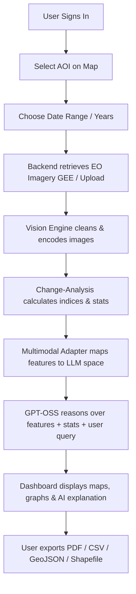

# SIH25170 — Project Overview

## 1. Introduction & Problem Statement

**Problem Statement:** Enhance OpenAI's open-weight `GPT-OSS` reasoning model with a vision pathway so it can understand Earth Observation (EO) imagery and reason about it in natural language. The system must be extensible to ISRO EO data and useful for land-cover classification, environmental monitoring, and change analysis.

### The Core Challenge
`GPT-OSS` is currently a text-only reasoning model. It cannot directly process visual raster data like satellite imagery. A naive approach might just feed text statistics into the model, but this strips away spatial relationship context. 
To solve this, our system designs a separate **vision encoder**, a **multimodal projection/alignment layer**, and feeds visual tokens along with structured EO metadata/features into the `GPT-OSS` model. This allows the model to "reason" over the visual features and generate evidence-grounded answers.

---

## 2. Executive Summary

We are building a web application where users can:
1. Select an Area of Interest (AOI) on a map interface.
2. Retrieve or upload Earth Observation (EO) imagery.
3. Compare two dates or years to detect landscape and environmental changes.
4. Interact with a specialized `GPT-OSS` AI analyst in natural language.
5. Receive visual evidence-backed, human-readable explanations alongside analytical statistics.
6. Export detailed reports as PDF, CSV, GeoJSON, or Shapefiles.

The hackathon version focuses on building a reliable, end-to-end processing and reasoning flow, avoiding unnecessary massive training costs by leveraging pre-trained vision models and training an efficient projection adapter.

---

## 3. Connected Project Goals

*   **Multimodal GPT-OSS:** Add a vision pathway to a text-only open-weight reasoning model without training the main LLM from scratch.
*   **EO Intelligence:** Build an extensible, standardized architecture compatible with multiple satellite sources: Sentinel-1 (SAR), Sentinel-2 (Optical), Landsat, and ISRO EO data (retrieved via platforms like Bhuvan/Bhoonidhi).

---

## 4. Core Value Proposition

> **Ask the satellite data a question.**
> The user does not need to know complex remote-sensing formulas or GIS tool syntax to get a useful answer. The system exposes the raw data and calculations alongside the AI explanation so that domain experts can verify the result.

### Example User Interactions:
*   *Question:* "What changed in this area between 2020 and 2025, and is the vegetation loss significant?"
*   *Response:* The system highlights changed regions on the map, calculates that vegetation decreased by 18.7% (with a mean NDVI dropping from 0.61 to 0.44), provides an area estimation of $18.4\text{ km}^2$, and explains the environmental implications in natural language with specific caveats.

---

## 5. Recommended MVP Flow

1.  **User Access:** Authenticate via JWT-based secure sessions.
2.  **AOI Selection:** Draw a bounding box/polygon on the interactive map.
3.  **Temporal Choice:** Define "Before" and "After" dates.
4.  **Retrieval:** Pull Sentinel-2 optical bands from Google Earth Engine (GEE).
5.  **Preprocessing:** Reproject, mask clouds, scale, and tile the imagery.
6.  **Feature Extraction:** Calculate indices (NDVI, NDWI, NDBI) and run change detection.
7.  **Alignment:** Embed visual tokens and align them with LLM dimensions.
8.  **Reasoning:** LLM executes deterministic tools to retrieve specific statistics instead of hallucinating.
9.  **Visualization:** Render split maps (Before/After/Change) and index charts.
10. **Export:** Provide multi-format report exports for GIS and presentation needs.
