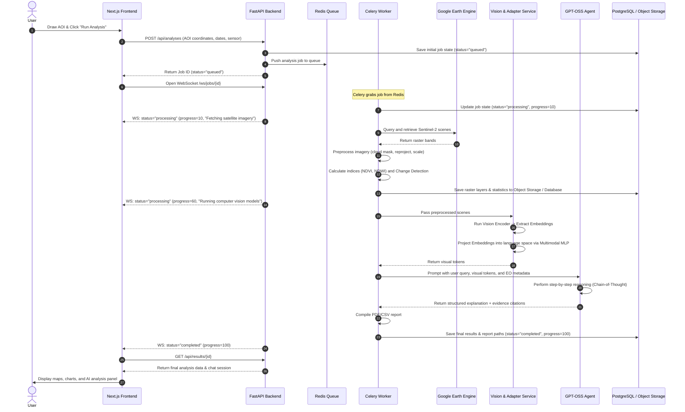

# SIH25170 — System Architecture

This document describes the layered system architecture, data flow sequences, repository folder structure, and deployment infrastructure for the **GPT-OSS Multimodal Vision for Earth Observation Data** platform.

---

## 1. Clean Implementation Architecture (Layered View)

The system is separated into logical layers to facilitate parallel development and ensure the modular exchange of engines (e.g., swapping GEE with ISRO Bhoonidhi or swapping the Vision Encoder) without rewriting the application.

```
┌───────────────────────────────────────────────────────────────────────────┐
│                              USER / UI LAYER                              │
│  • Next.js + React + TypeScript + Tailwind CSS                            │
│  • MapLibre GL JS / Leaflet (Interactive GIS)                             │
│  • User actions: Upload Image, Draw AOI, Select Dates, Chat, Export      │
└─────────────────────────────────────┬─────────────────────────────────────┘
                                      │
                                      ▼  HTTP / WebSockets
┌───────────────────────────────────────────────────────────────────────────┐
│                        API & APPLICATION LAYER                           │
│  • FastAPI (Python)                                                       │
│  • JWT Authentication & Request Validation                                │
│  • Task Broker: Redis + Celery / RQ Queue                                 │
│  • WebSockets (Real-time progress updates)                                │
└─────────────────────────────────────┬─────────────────────────────────────┘
                                      │
                                      ▼  Job Delegation
┌───────────────────────────────────────────────────────────────────────────┐
│                     EO DATA ENGINE & CORE BACKEND                         │
│  • Google Earth Engine (GEE) SDK / ISRO Connector                         │
│  • EO Preprocessor (Cloud mask, Normalize, Reproject, Tile)               │
│  • Geospatial Calculators (NDVI, NDWI, NDBI, Change Mask)                 │
└─────────────────────────────────────┬─────────────────────────────────────┘
                                      │
                                      ▼  Feature & Embeddings Extraction
┌───────────────────────────────────────────────────────────────────────────┐
│                       VISION & ALIGNMENT ENGINES                          │
│  • Vision Encoder (ViT / ResNet / CLIP-style)                             │
│  • Multimodal Adapter (Projection MLP Layer)                              │
│  • Visual Token Generator (Maps embeddings to LLM space)                  │
└─────────────────────────────────────┬─────────────────────────────────────┘
                                      │
                                      ▼  Tokens Injection & Tool Calls
┌───────────────────────────────────────────────────────────────────────────┐
│                       GPT-OSS AI AGENT ORCHESTRATOR                       │
│  • GPT-OSS (20B / 120B Open-Weight Reasoning Model)                       │
│  • Structured Prompting System                                            │
│  • Deterministic Tool Calls (get_eo_scene, calculate_indices, etc.)       │
└───────────────────────────────────────────────────────────────────────────┘
```

---

## 2. Dynamic Analysis Flow Sequence

The diagram below details the sequence of actions that occur when a user triggers a new analysis:



---

## 3. Recommended Monorepo Folder Structure

Keeping machine learning experiments and engineering codebases decoupled is critical. This layout separates the frontend UI, production API services, background task workers, and offline ML research code.

```text
sih25170-project/
├── frontend/                   # Next.js + React + TypeScript + Tailwind UI
│   ├── app/                    # Next.js App Router (dashboard, workspace, analyst, history)
│   ├── components/             # Reusable UI widgets
│   │   ├── ui/                 # shadcn primitive controls (buttons, cards, etc.)
│   │   ├── map/                # Leaflet / MapLibre mapping components
│   │   ├── charts/             # Recharts (NDVI time-series, land-cover donut charts)
│   │   └── ai/                 # AI Analyst panel components
│   ├── services/               # API integration client modules
│   └── types/                  # Global TypeScript interfaces
│
├── backend/                    # Python FastAPI API & Worker
│   ├── app/
│   │   ├── api/                # FastAPI routers (auth, projects, analyses, chat, reports)
│   │   ├── auth/               # Password hashing & JWT generation
│   │   ├── db/                 # PostgreSQL database setup & migrations
│   │   └── models/             # SQLAlchemy ORM models
│   ├── services/
│   │   ├── eo/                 # Google Earth Engine and upload connectors
│   │   ├── vision/             # Feature extractor wrappers
│   │   ├── multimodal/         # Alignment layer inference
│   │   ├── llm/                # GPT-OSS prompt templates & agent tools
│   │   ├── analysis/           # Geospatial libraries (rasterio, geopandas)
│   │   └── reports/            # ReportLab PDF compilation
│   ├── workers/                # Celery tasks and task loops
│   ├── main.py                 # FastAPI application entry point
│   └── tests/                  # Integration and unit tests
│
├── ml/                         # Offline Machine Learning & Experiments
│   ├── datasets/               # Data loaders (EuroSAT, BigEarthNet)
│   ├── preprocessing/          # Image normalizers and band selectors
│   ├── vision_encoder/         # Encoder models code (ViT, ResNet)
│   ├── projector/              # Multimodal alignment MLP training loops
│   ├── training/               # LoRA or projection layer training scripts
│   └── evaluation/             # Model validation scripts (VQA metrics)
│
├── infra/                      # DevOps & Deployments
│   ├── docker/                 # Custom Dockerfiles
│   │   ├── frontend.Dockerfile
│   │   ├── backend.Dockerfile
│   │   └── worker.Dockerfile
│   ├── nginx/                  # Nginx reverse proxy configuration
│   └── docker-compose.yml      # Multi-container startup configuration
│
└── README.md                   # Main entry point documentation
```

---

## 4. Deployment and Infrastructure

| Component | Hackathon Option (Fast Setup) | Production Upgrade (Scalable) |
| :--- | :--- | :--- |
| **Frontend Host** | Vercel / Netlify | CDN + Managed Cloud Deployment |
| **Backend Host** | Docker container on single Cloud VM (AWS EC2 / GCP Compute Engine) | Kubernetes cluster (EKS / GKE) with auto-scaling |
| **Database** | Managed PostgreSQL (Render / Supabase) | High-Availability (HA) PostgreSQL with PgBouncer |
| **Broker / Cache** | Docker-based Redis | Managed Redis Cluster (e.g., ElastiCache) |
| **Object Storage** | Local directory mount or MinIO S3 container | AWS S3 / Google Cloud Storage with expiry policies |
| **AI Inference** | Quantized model run on single GPU VM (RunPod / Paperspace) | Dedicated Triton Inference Server cluster |
| **EO Data access** | GEE Service Account Key credentials | GEE Enterprise Service Account with high-throughput quotas |
| **CI / CD** | GitHub Actions (Auto-deploy on merge to `main`) | Multi-stage pipeline with automated security scanning |
