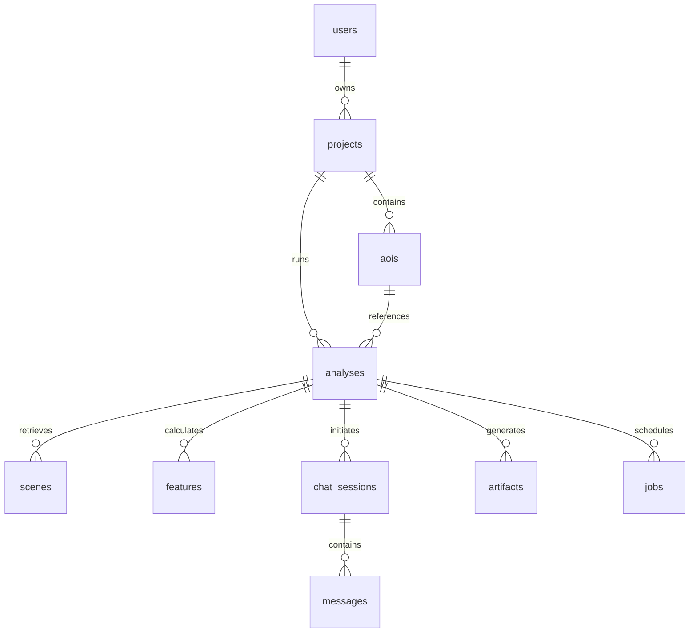

# SIH25170 — Backend API & Database Specification

This document details the FastAPI application modules, database schema, REST API endpoints, and background worker configurations for the **GPT-OSS Multimodal Vision for Earth Observation Data** backend.

---

## 1. Core Modules & Responsibilities

The backend is built in Python using **FastAPI** to support asynchronous operations, type safety, and automatic OpenAPI documentation generation.

| Module | Responsibility |
| :--- | :--- |
| **`auth`** | User registration, password hashing (Argon2id/bcrypt), JWT token issue, and session validation. |
| **`projects`** | Project CRUD operations; logical grouping of multiple analyses under a single project namespace. |
| **`eo`** | Connector interfaces for GEE, Sentinel Hub, Landsat, and ISRO APIs; metadata catalog queries. |
| **`preprocess`** | Python pipeline (using rasterio/GDAL) for cloud masking, re-projection, cropping, and tiling. |
| **`analysis`** | Fast NumPy/Geopandas calculations of indices (NDVI/NDWI/NDBI) and change mask thresholding. |
| **`vision`** | Running local GPU/CPU inference to extract image patch feature embeddings (ViT/ResNet). |
| **`multimodal`** | Maps vision features to token coordinates using the projection adapter. |
| **`llm`** | Prompt construction, agent routing, tool call execution, and GPT-OSS structured output parsing. |
| **`jobs`** | Pushing long-running processing jobs to Celery task workers; updating progress via Redis. |
| **`chat`** | Managing conversational history, loading past analysis context, and matching citations. |
| **`reports`** | PDF report compilation (ReportLab) and GeoJSON/CSV exporters. |

---

## 2. API Contract — Core Endpoints

Every API request must include a `X-Request-ID` header. If missing, the API gateway or FastAPI middleware generates one to trace requests through the asynchronous Celery pipeline.

### 2.1 Authentication & Management
*   `POST /auth/register` — Registers a new user.
*   `POST /auth/login` — Authenticates credentials; returns JWT token.
*   `GET /projects` — Lists all projects owned by the logged-in user.
*   `POST /projects` — Creates a new project workspace.
*   `POST /aois` — Saves a polygon or bounding box geometry to the database.

### 2.2 Analysis Operations
*   `POST /analyses` — Submits a new EO job configuration.
    *   *Payload:* `{ "project_id": "uuid", "aoi_id": "uuid", "start_date": "2020-01-01", "end_date": "2025-01-01", "sensor": "Sentinel-2", "options": { "ndvi": true } }`
    *   *Response:* `{ "job_id": "uuid", "status": "queued", "created_at": "timestamp" }`
*   `GET /analyses/{id}` — Returns the overall status, progress percentage, and metadata.
*   `GET /analyses/{id}/layers` — Returns links to map rasters (Before, After, Change Mask).
*   `GET /analyses/{id}/timeseries` — Returns historical index coordinates for chart plotting.
*   `GET /analyses/{id}/statistics` — Returns calculated numeric statistics (change area, percentage deltas).

### 2.3 AI Interaction & Reports
*   `POST /analyses/{id}/chat` — Submits a question about the specific analysis.
    *   *Payload:* `{ "message": "Why did the vegetation decrease?" }`
    *   *Response:* `{ "reply": "...", "evidence": { ... } }`
*   `POST /analyses/{id}/export` — Triggers report compilation.
    *   *Payload:* `{ "format": "pdf" }`
    *   *Response:* `{ "export_id": "uuid", "status": "completed", "download_url": "..." }`
*   `GET /exports/{id}` — Downloads the compiled PDF, CSV, or GeoJSON file.
*   `WS /ws/jobs/{id}` — WebSocket connection for real-time progress bar and status steps updates.

### 2.4 Error Response Schema
```json
{
  "error": "INVALID_AOI",
  "message": "AOI must be a valid polygon under 50 square kilometers.",
  "request_id": "req-987654321-abc"
}
```

---

## 3. Database Schema (PostgreSQL)

The entity relationships are structured in PostgreSQL to maintain absolute referential integrity.



### Table Definitions (Key Fields)

#### 1. `users`
*   `id` (UUID, Primary Key)
*   `email` (VARCHAR, Unique, Indexed)
*   `password_hash` (VARCHAR)
*   `name` (VARCHAR)
*   `role` (VARCHAR, e.g., 'user', 'admin')
*   `created_at` (TIMESTAMP)

#### 2. `projects`
*   `id` (UUID, Primary Key)
*   `user_id` (UUID, Foreign Key referencing `users.id`)
*   `name` (VARCHAR)
*   `description` (TEXT)
*   `created_at` (TIMESTAMP)

#### 3. `aois`
*   `id` (UUID, Primary Key)
*   `project_id` (UUID, Foreign Key referencing `projects.id`)
*   `geometry` (GEOMETRY, PostGIS format for polygons)
*   `bbox` (DECIMAL[], bounding box coordinates)
*   `area_km2` (DECIMAL)

#### 4. `analyses`
*   `id` (UUID, Primary Key)
*   `project_id` (UUID, Foreign Key referencing `projects.id`)
*   `aoi_id` (UUID, Foreign Key referencing `aois.id`)
*   `start_date` (DATE)
*   `end_date` (DATE)
*   `status` (VARCHAR, e.g., 'queued', 'processing', 'completed', 'failed')
*   `model_version` (VARCHAR)

#### 5. `scenes`
*   `id` (UUID, Primary Key)
*   `analysis_id` (UUID, Foreign Key referencing `analyses.id`)
*   `sensor` (VARCHAR)
*   `acquisition_date` (TIMESTAMP)
*   `cloud_cover` (DECIMAL)
*   `source_id` (VARCHAR)

#### 6. `features`
*   `id` (UUID, Primary Key)
*   `analysis_id` (UUID, Foreign Key referencing `analyses.id`)
*   `ndvi` (JSON, contains mean, min, max values before/after)
*   `ndwi` (JSON)
*   `ndbi` (JSON)
*   `changed_area_km2` (DECIMAL)
*   `confidence` (DECIMAL)

#### 7. `chat_sessions`
*   `id` (UUID, Primary Key)
*   `analysis_id` (UUID, Foreign Key referencing `analyses.id`)
*   `user_id` (UUID, Foreign Key referencing `users.id`)
*   `created_at` (TIMESTAMP)

#### 8. `messages`
*   `id` (UUID, Primary Key)
*   `session_id` (UUID, Foreign Key referencing `chat_sessions.id`)
*   `role` (VARCHAR, e.g., 'user', 'assistant')
*   `content` (TEXT)
*   `evidence_json` (JSONB, stores citations & raw metrics used)
*   `created_at` (TIMESTAMP)

#### 9. `artifacts`
*   `id` (UUID, Primary Key)
*   `analysis_id` (UUID, Foreign Key referencing `analyses.id`)
*   `type` (VARCHAR, e.g., 'pdf', 'csv', 'geojson', 'raster')
*   `storage_uri` (VARCHAR, S3 location)
*   `checksum` (VARCHAR)
*   `created_at` (TIMESTAMP)

#### 10. `jobs`
*   `id` (UUID, Primary Key)
*   `analysis_id` (UUID, Foreign Key referencing `analyses.id`)
*   `queue` (VARCHAR)
*   `status` (VARCHAR)
*   `progress` (INTEGER)
*   `error` (TEXT)
*   `started_at` (TIMESTAMP)
*   `finished_at` (TIMESTAMP)

---

## 4. Background Job Worker Strategy

Satellite image download, re-projection, and deep-learning calculations are expensive and can easily block the API request-response cycle.

*   **Queue Technology:** **Redis** acts as the message broker, combined with **Celery** or **RQ** workers.
*   **Decoupled Architecture:** The FastAPI web servers handle light transactions (authentication, query database history, retrieve static results). They forward expensive analysis and ML tasks to workers.
*   **Progress Streaming:** Celery tasks update their progress state in Redis. The FastAPI application subscribes to these channels and publishes the live percentage updates to the user's browser over WebSockets.
